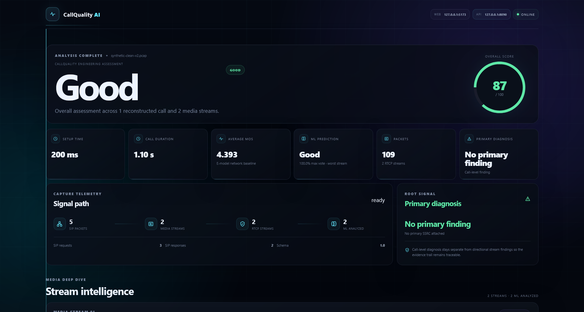

# CallQuality AI

> **Local-first VoIP call quality analysis, diagnosis, and machine-learning prediction from PCAP captures.**

CallQuality AI turns low-level VoIP network evidence into an interpretable quality report by combining **SIP/SDP signaling, RTP/RTCP analysis, engineering-based quality assessment, diagnosis rules, and native machine learning**.

The project is designed to run locally on a normal developer machine without paid AI APIs, cloud inference, GPU requirements, or a physical VoIP laboratory.

---

## What It Does

```text
PCAP
  │
  ├── SIP / SDP
  ├── RTP
  └── RTCP
        │
        ▼
Protocol Analysis
        │
        ▼
Feature Extraction
        │
        ├── Quality Engine
        ├── E-model / MOS Estimate
        ├── Diagnosis Engine
        └── Native ML Inference
                │
                ▼
        Unified Quality Report
                │
                ▼
        CLI / REST API / Web Dashboard
```

Instead of looking at isolated packet counters, CallQuality AI combines multiple sources of network evidence to answer two practical questions:

**How degraded is the call?**

**What network conditions are most likely contributing to that degradation?**

---

## Highlights

| Capability | Description |
|---|---|
| **PCAP Analysis** | Analyze classic `.pcap` captures locally |
| **SIP / SDP** | Signaling and media-session reconstruction |
| **RTP Analysis** | Loss, jitter, duplicates, reordering, packet statistics |
| **RTCP Analysis** | Reports, jitter, loss, passive RTT, stream correlation |
| **Quality Engine** | Explainable engineering-based quality scoring |
| **E-model** | Estimated R-factor and MOS for the supported baseline |
| **Diagnosis** | Rule-based degradation findings and contributing factors |
| **Native ML** | Embedded Random Forest inference in Go |
| **REST API** | Local HTTP API for programmatic analysis |
| **Web Dashboard** | React + TypeScript control-room interface |
| **Synthetic Research** | Reproducible impairment scenarios and dataset generation |

---
## Dashboard Preview



---

## Research Snapshot

The ML component was trained and evaluated on a controlled **synthetic V4 dataset** generated from reproducible VoIP/network impairment scenarios.

### Dataset

```text
700 synthetic captures
1,400 analyzed RTP stream records
7 scenario families
```

Current scenario families include:

```text
clean
loss
jitter
latency
reorder
duplicate
combined
```

### Evaluation

The current Random Forest experiment achieved:

| Metric | Held-out Test |
|---|---:|
| Accuracy | **93.81%** |
| Balanced Accuracy | **88.05%** |
| Macro F1 | **90.25%** |

The experiment used group-aware evaluation by `sample_id` to avoid placing related records from the same generated sample into both training and test partitions.

The selected model was exported as a portable JSON artifact and verified against the native Go implementation.

### Native Model Verification

```text
Model: Random Forest v1
Trees: 700
Transformed features: 29

Independent parity checks:
250 / 250 predictions matched
Probability parity: verified
Maximum probability difference: 0.0
```

These results describe the controlled synthetic experiment and **should not be interpreted as production-world accuracy or subjective speech-quality accuracy**.

---

## What the Analyzer Measures

### RTP

The RTP analysis layer can calculate:

- Packet count
- Unique packets
- Duplicate packets
- Expected packets
- Lost packets
- Packet-loss percentage
- Sequence gaps
- Out-of-order packets
- Inter-arrival jitter
- Packet-rate statistics
- Media direction

### RTCP

When RTCP evidence is available:

- Receiver Reports
- Sender Reports
- Reported packet loss
- Reported jitter
- Passive RTT estimates
- RTP / RTCP stream correlation

The analyzer distinguishes between **observed**, **calculated**, and **unavailable** values rather than inventing missing measurements.

---

## Engineering Quality Assessment

The non-ML quality engine evaluates measurable network/media conditions including:

```text
Packet Loss
Jitter
RTT
Packet Reordering
Duplicate Packets
```

It produces an explainable quality score and quality level.

The engineering layer remains independent from the ML layer, allowing the project to compare deterministic network evidence with learned predictions.

---

## E-model / MOS

Where the required information is available, CallQuality AI calculates a simplified E-model-based baseline for a narrowband G.711-oriented scenario.

The resulting MOS is an **engineering estimate** based on the available evidence.

It is not presented as equivalent to:

- Subjective listening tests
- Human-perception studies
- Production carrier-grade voice-quality measurement

---

## Diagnosis Engine

The diagnosis engine combines measured evidence with engineering rules to identify probable degradation conditions.

Examples include:

- High packet loss
- High jitter
- High RTT
- Packet reordering
- Duplicate packets
- Mixed degradation
- RTP / RTCP disagreement
- Insufficient evidence
- Unavailable metrics

The diagnosis layer is deliberately evidence-oriented.

A finding is treated as an indication supported by the observed data, not as an absolute physical root-cause claim.

---

## Machine Learning

The ML layer is an experimental prediction component built around lightweight classical models.

Research candidates include:

- Logistic Regression
- Random Forest
- Gradient Boosting

The selected model is exported from the research environment and embedded into the Go application.

### Runtime Design

```text
Research
   │
   ▼
Python / scikit-learn
   │
   ▼
Versioned Model Artifact
   │
   ▼
Native Go Inference
   │
   ▼
Local Prediction
```

The final application does not require the training environment to be online.

No external AI API is required for inference.

---

## Explainability

The system exposes model-oriented evidence such as:

- Predicted quality class
- Class probabilities
- Feature importance
- Dominant degradation factors

The explanation describes what the model and observed metrics indicate; it does not claim certainty about the physical cause of a network problem.

---

## Synthetic Research Pipeline

The repository contains a reproducible synthetic-data pipeline because the project does not depend on a physical VoIP laboratory.

Controlled scenarios can vary:

- Packet loss
- Jitter
- RTT
- Packet reordering
- Duplicate packets
- Combined impairments
- Packet rate
- Codec
- Call duration

The synthetic pipeline is used for:

- Testing
- Dataset generation
- Model training
- Research experiments
- Demonstrations
- Regression testing

Synthetic traffic is intentionally kept separate from real-world validation.

---

## Included Demo Captures

Representative PCAP files are included for quick experimentation:

```text
samples/
└── demo/
    ├── synthetic-clean-v2.pcap
    ├── loss-003.pcap
    ├── jitter-003.pcap
    ├── latency-003.pcap
    ├── reorder-003.pcap
    ├── duplicate-003.pcap
    └── combined-003.pcap
```

The larger reproducible dataset is stored separately:

```text
samples/
└── synthetic-dataset-v4/
    ├── dataset.csv
    ├── manifest.csv
    └── synthetic PCAP captures
```

---

## Web Dashboard

CallQuality AI includes a local React dashboard for interactive analysis.

The interface presents a technical control-room view of:

- Capture status
- Reconstructed calls
- Overall quality
- RTP metrics
- RTCP metrics
- E-model / MOS estimate
- Diagnosis findings
- ML prediction
- Prediction probabilities
- Stream-level analysis
- API connection state

### Run

Start the Go API:

```bash
cd app
go run ./cmd/callquality-api -listen 127.0.0.1:8090
```

Then start the dashboard:

```bash
cd web
npm install
npm run dev
```

Open:

```text
http://127.0.0.1:5173
```

Development flow:

```text
React Dashboard
127.0.0.1:5173
        │
        ▼
Vite /api Proxy
        │
        ▼
Go Analysis API
127.0.0.1:8090
        │
        ▼
PCAP Analysis Pipeline
```

The default Go API address remains:

```text
127.0.0.1:8080
```

Port `8090` is used by the included dashboard development setup through the `-listen` option.

---

## CLI

The Go CLI provides the main local analysis interface.

### Analyze

```bash
callquality analyze call.pcap
```

### Export CSV

```bash
callquality export call.pcap --format csv --output features.csv
```

### Export JSON

```bash
callquality export call.pcap --format json --output features.json
```

### Predict

```bash
callquality predict call.pcap
```

### Version

```bash
callquality version
```

---

## REST API

The local HTTP API provides:

```text
GET  /api/v1/health
GET  /api/v1/version
POST /api/v1/analyze
```

Analyze a PCAP using:

```text
POST /api/v1/analyze
Content-Type: multipart/form-data
```

The upload field is:

```text
file
```

Default maximum upload size:

```text
64 MiB
```

See [`docs/API.md`](docs/API.md) for the complete API contract.

---

## Architecture

```text
CallQuality AI/
│
├── app/
│   ├── cmd/
│   │   ├── callquality/
│   │   ├── callquality-api/
│   │   ├── datasetgen/
│   │   └── gencapture/
│   │
│   └── internal/
│       ├── analyzer/
│       ├── api/
│       ├── callanalysis/
│       ├── diagnosis/
│       ├── emodel/
│       ├── export/
│       ├── features/
│       ├── ml/
│       ├── pcap/
│       ├── pipeline/
│       ├── quality/
│       ├── rtcp/
│       ├── rtp/
│       ├── sdp/
│       └── sip/
│
├── docs/
│   ├── API.md
│   ├── ARCHITECTURE.md
│   ├── DATASET.md
│   ├── ML_INFERENCE.md
│   └── STACK.md
│
├── research/
│   └── models/
│
├── samples/
│   ├── demo/
│   └── synthetic-dataset-v4/
│
├── web/
│   ├── src/
│   └── ...
│
├── PROJECT_SPEC.md
├── README.md
└── .gitignore
```

---

## Technology Stack

### Core

- Go
- gopacket
- Go standard library

### VoIP / Network Analysis

- SIP
- SDP
- RTP
- RTCP
- PCAP

### Machine Learning

- Python
- NumPy
- pandas
- scikit-learn
- Random Forest

### Frontend

- React
- TypeScript
- Vite

### Research

- Google Colab
- Reproducible synthetic datasets
- Versioned model artifacts

---

## Testing

The Go application contains automated tests covering the main analysis layers:

- PCAP reading
- Packet decoding
- SIP parsing
- SDP parsing
- RTP parsing
- RTP stream tracking
- RTP jitter calculation
- RTCP parsing
- RTP / RTCP correlation
- Media metrics
- Feature extraction
- Quality scoring
- E-model calculations
- Diagnosis rules
- Call analysis
- API behavior
- Dataset generation
- Native ML inference

The project is structured so that individual protocol and analysis components can be tested independently while still supporting an integrated end-to-end pipeline.

---

## Design Principles

CallQuality AI follows these core principles:

**Correctness**

Measurements should come from available protocol evidence rather than assumptions.

**Reproducibility**

Synthetic experiments, dataset generation, model artifacts, and evaluation conditions should be repeatable.

**Explainability**

The system should expose why a quality result or prediction was produced.

**Local-First Execution**

The final application should work without depending on external AI services.

**Separation of Evidence and Inference**

Measured network data, deterministic engineering calculations, and ML predictions should remain distinguishable.

**Minimal Dependencies**

Libraries should be evaluated for compatibility and adopted only when they provide clear value.

---

## Limitations

CallQuality AI is an engineering and research project rather than a production carrier-grade monitoring platform.

Important limitations include:

- Synthetic traffic does not capture the complete variability of real-world VoIP networks.
- Network metrics do not perfectly represent human speech perception.
- E-model / MOS values are estimates based on available evidence.
- ML results depend on the dataset and experimental conditions.
- Real-world generalization requires validation against larger and more diverse captures.
- Some measurements are unavailable when the required protocol evidence is absent.

The project intentionally avoids unsupported claims about production performance.

---

## Documentation

Detailed technical documentation:

- [`docs/API.md`](docs/API.md) — HTTP API
- [`docs/ARCHITECTURE.md`](docs/ARCHITECTURE.md) — System architecture
- [`docs/DATASET.md`](docs/DATASET.md) — Dataset and synthetic-data workflow
- [`docs/ML_INFERENCE.md`](docs/ML_INFERENCE.md) — Native ML inference
- [`docs/STACK.md`](docs/STACK.md) — Technology stack
- [`PROJECT_SPEC.md`](PROJECT_SPEC.md) — Project specification and research direction

---

## Research Direction

The project explores the following question:

> Can lightweight machine-learning models use RTP/RTCP-derived network features to predict VoIP call-quality degradation and identify dominant contributing factors?

The broader research pipeline is:

```text
Network Evidence
      ↓
Protocol Analysis
      ↓
Feature Extraction
      ↓
Engineering Baseline
      ↓
Machine Learning
      ↓
Explainability
      ↓
Diagnosis
      ↓
Visualization
      ↓
Benchmarking
      ↓
Reproducible Research
```

---

## Current Scope

The current implementation focuses on:

```text
PCAP-based analysis
RTP / RTCP metrics
SIP / SDP processing
Engineering quality scoring
E-model baseline
Rule-based diagnosis
Native ML inference
REST API
React dashboard
Synthetic dataset generation
```

Future extensions may include live capture, additional codecs and traffic conditions, broader real-world validation, benchmarking, and expanded simulation capabilities.

---

## Project Goal

CallQuality AI is intended to demonstrate both:

1. **A practical local VoIP analysis tool**
2. **A reproducible experimental research project**

The goal is to connect network engineering, protocol analysis, data science, and software engineering in one coherent system.

---

## License

License information will be added with the repository release.